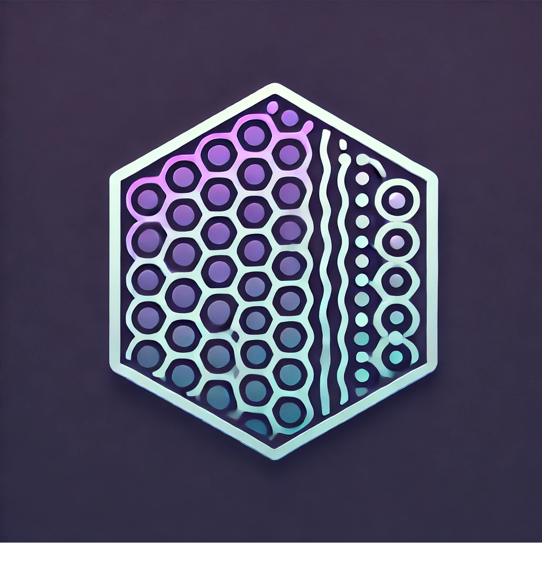

# Indralux
[](LICENSE)

<p align="center">
  <br>
  <em></em>
</p>

<p align="center">
  <a href="https://indralux.streamlit.app/">Live App</a> •
  <a href="https://github.com/Batchu-Sai/Indralux">GitHub Repo</a> •
  <a href="docs/metrics_table.md">Full Metrics Table</a> •
  <a href="#how-it-works">How It Works</a>
</p>

Quantifying endothelial barrier disruption with image-based metrics.

Indralux is an advanced image analysis pipeline. It combines biologically grounded quantification with metrics inspired by structural engineering and image science, oriented towards cellular barrier diruption analyses

---

## Key Features

- Segment individual cells from immunofluorescent images
- Compute per-cell and per-image metrics for:
  - VE-cadherin localization and signal-to-noise
  - Actin cytoskeleton integrity
  - Nuclear compaction (DAPI)
  - Junctional fragmentation (periphery breaks)
  - Cell shape (circularity, solidity, aspect ratio)
  - Intercellular space (gap area, density, max gap)
  - Curvature irregularity of junctions
- Composite Disruption Index to track overall damage
- Overlay images with contours and cell IDs
- Multi-metric summary plots and spatial heatmaps
- Export results as CSV, Markdown, LaTeX
- CLI support and Jupyter demos

---
## Citation

If you use this tool in your work, please cite:

> Indralux (2025)

---

## Installation

```bash
pip install .
```

Or use via CLI:
```bash
python cli.py --input path/to/image.tif --output results/ --n_columns 7 --column_labels Control 5 10 15 20 30 40
```

---

## Contributions

Built using open-source components: `scikit-image`, `OpenCV`, `numpy`, `pandas`, `matplotlib`.

Please see `indralux_full_metric_catalog.csv` for full metric descriptions.
